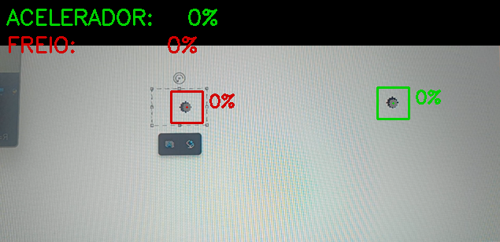
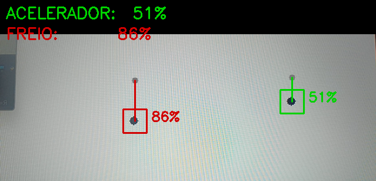
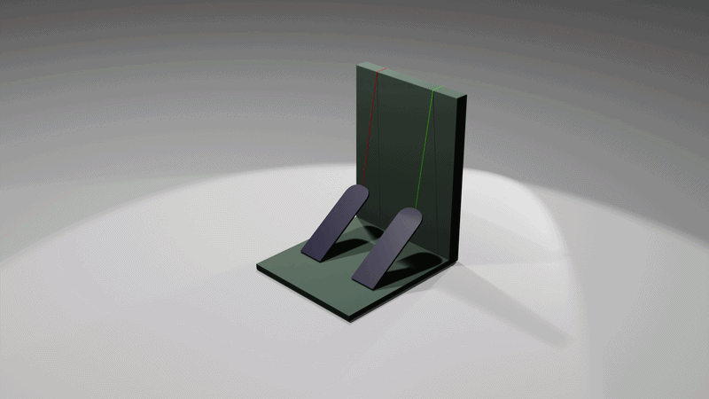

# 🎮 Pedal Vision

> Control racing simulators using only a webcam — no expensive hardware needed.

**Pedal Vision** uses computer vision to track two physical objects attached to your feet and maps their movement as **accelerator** and **brake** pedals for racing games — recognized by the system as a virtual Xbox 360 controller.



---
In the LEFT side, i'm moving the dots. Right side, the Software Window.

---
## 🔩 Hardware Concept



## 💡 The Idea

Racing wheels and pedals can cost hundreds of dollars. This project explores a zero-cost alternative: attach any object to your feet, point a webcam at them, and let the software do the rest.

You click on each object to teach the program what to track. It memorizes the texture/appearance of that region and follows it frame by frame — no color calibration, no markers, no special setup required.

---

## 🎥 How It Works

1. Run the script
2. **Click** on the object attached to your right foot → Accelerator
3. **Click** on the object attached to your left foot → Brake
4. Move your feet — the pedals respond in real time

The program uses **template matching** (`cv2.matchTemplate`) to track each object independently within its own horizontal zone, preventing one tracker from jumping to the other object.

Pedal intensity is calculated from vertical displacement:
```
pressure = abs(current_Y - initial_Y) / SENSITIVITY
```

---

## 🛠️ Installation

```bash
pip install -r requirements.txt
```

> **Windows only:** The virtual gamepad requires the [ViGEmBus driver](https://github.com/ViGEm/ViGEmBus/releases). Install it before running.

---

## ▶️ Usage

```bash
python cam_pedals.py
```

| Key | Action |
|-----|--------|
| Click | Mark accelerator / brake object |
| `R` | Reset and reconfigure |
| `Q` | Quit |

---

## ⚙️ Configuration

At the top of `cam_pedals.py` you can adjust:

```python
REGIAO        = 40   # size of the captured region when clicking (pixels)
SENSIBILIDADE = 80   # pixels of movement = 100% pedal pressure
MARGEM_X      = 120  # horizontal search zone for each tracker (pixels)
```

---

## 🔧 Hardware Suggestions

You need something visible on camera that moves with your foot. Some simple options:

- 🥇 A small heavy object (like a fishing weight or a coin roll) tied to a string — gravity keeps it stable and returns it to rest position naturally
- 🥈 Any object on a string with an elastic band pulling it back — the elastic acts as a return spring, making the movement consistent
- 🥉 Any small distinct object attached to your foot — what matters is that it moves vertically when you press down

The heavier the object, the more stable the tracking. A simple physical pedal (wooden board + hinge) is the ideal next step.

---

## 🤝 Contributing

This is an open project and contributions are very welcome! Some ideas:

- [ ] Linux/macOS support (replace `vgamepad` with `evdev`)
- [ ] GUI for configuration (Tkinter or PyQt)
- [ ] Physical pedal hardware design (3D print or woodwork)
- [ ] Auto-calibration without clicking
- [ ] Support for clutch (3rd pedal)
- [ ] Profiles saved per game

---

## 📋 Roadmap

- [x] Template-based tracking (click to select)
- [x] Independent horizontal zones (no cross-tracking)
- [x] Virtual Xbox 360 gamepad output
- [ ] Physical pedal hardware design
- [ ] Packaging as standalone executable

---

## 🤖 Transparency

This project was developed with the assistance of AI (Perplexity AI) as a coding tool.
The concept, testing, iteration and direction were driven by [@gustarock190](https://github.com/gustarock190).

Using AI as a tool is part of modern development — what matters is the idea and what you build with it.

---

## 📄 License

MIT License — free to use, modify and distribute.

---

<p align="center">
  Made with curiosity in Manaus 🌿 by <a href="https://github.com/gustarock190">@gustarock190</a>
</p>
